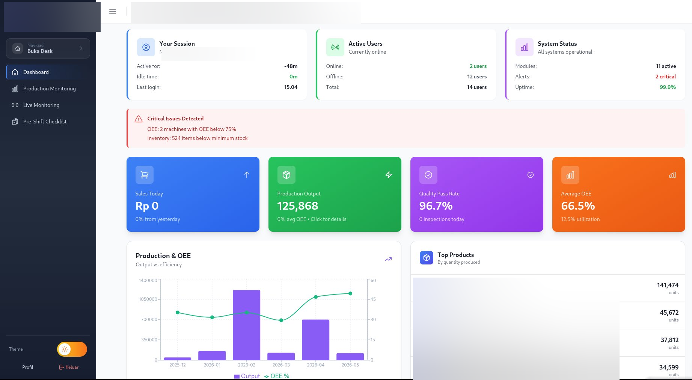
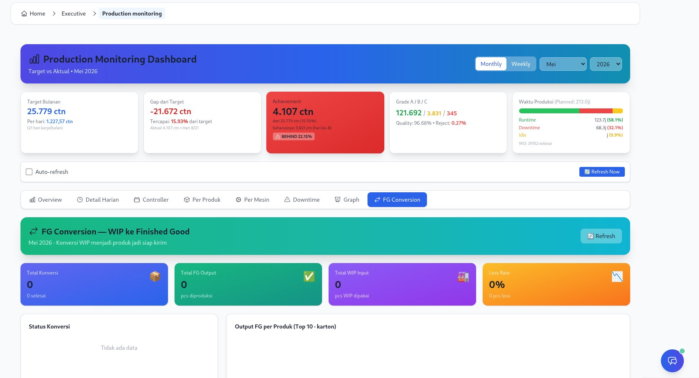
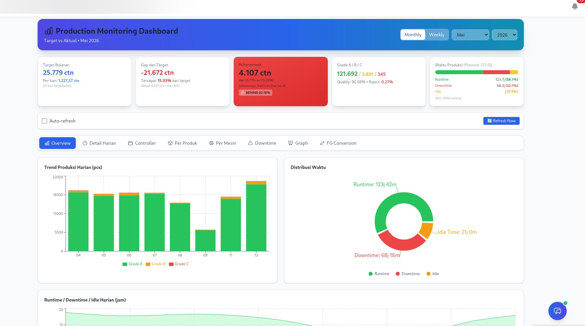
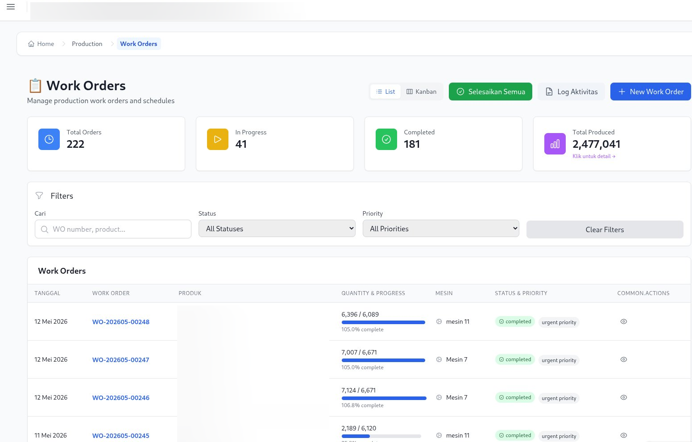
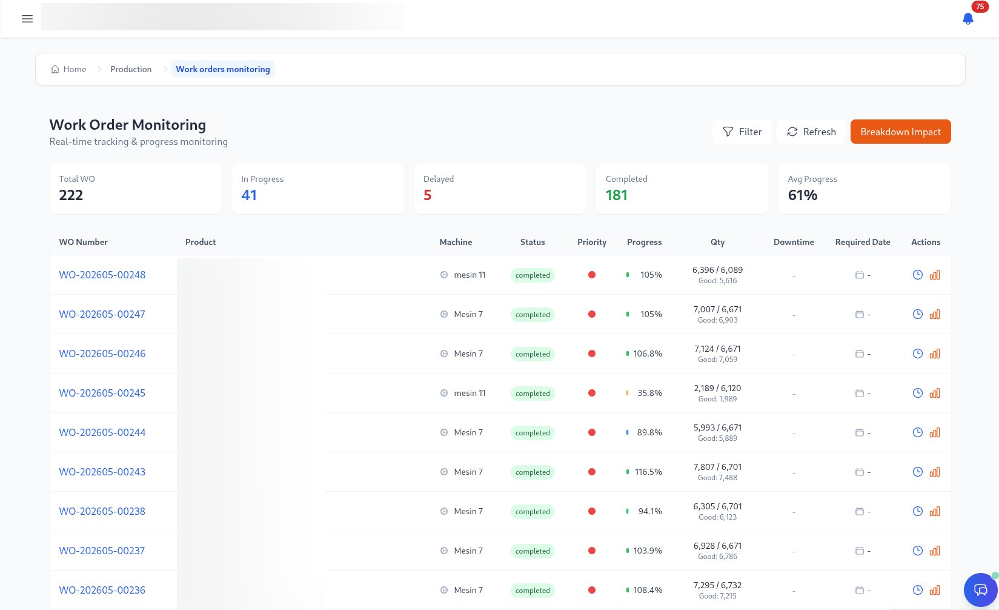

# 🏭 SMITH ERP — Sistem Perencanaan Sumber Daya Manufaktur

> **Sistem Manajemen Perusahaan Lengkap untuk Manufaktur Nonwoven**

[](https://github.com/bayuadhie-dev/smith/actions/workflows/ci.yml)
[](https://codecov.io/gh/bayuadhie-dev/smith)
[](https://www.python.org/)
[](https://flask.palletsprojects.com/)
[](https://reactjs.org/)
[](https://www.typescriptlang.org/)
[](LICENSE)

## 📋 Daftar Isi

- [Tentang Sistem](#tentang-sistem)
- [Screenshots](#screenshots)
- [Fitur Utama](#fitur-utama)
- [Arsitektur Sistem](#arsitektur-sistem)
- [Teknologi yang Dipakai](#teknologi-yang-dipakai)
- [Modul-Modul](#modul-modul)
- [Integrasi Workflow](#integrasi-workflow)
- [Cara Install](#cara-install)
- [Pengujian](#pengujian)
- [Dokumentasi API](#dokumentasi-api)
- [AI Assistant](#ai-assistant)

---

## 🎯 Tentang Sistem

**Sistem ERP Nonwoven** adalah aplikasi manajemen perusahaan yang terintegrasi penuh, didesain khusus buat industri manufaktur nonwoven. Sistem ini ngatur semua proses bisnis dari penjualan, produksi, quality control, sampai keuangan dalam satu platform yang terpadu.

### 🌟 Keunggulan

- ✅ **Arsitektur Modern Full-Stack** - Flask REST API + React TypeScript
- ✅ **Asisten AI Terintegrasi** - Query data ERP dengan bahasa natural Indonesia
- ✅ **Sinkronisasi Data Real-time** - Update langsung di semua modul
- ✅ **Otomasi Workflow Lengkap** - Sales → MRP → Produksi → Quality → Shipping → Finance
- ✅ **Multi-bahasa** - Indonesia & English (i18n)
- ✅ **Kontrol Akses Berbasis Role** - Sistem permission yang detail
- ✅ **Responsive Mobile** - Jalan di desktop, tablet, dan mobile
- ✅ **20+ Modul Bisnis** - Semua proses bisnis terintegrasi
- ✅ **Arsitektur Scalable** - Desain siap microservices

---

## 📸 Screenshots

### Dashboard Eksekutif


### Production Monitoring — Executive View


### Production Monitoring — Dashboard


### Work Orders


### Work Order Monitoring


---

## 🚀 Fitur Utama

### 📊 Kecerdasan Bisnis
- **🎯 Dashboard Eksekutif** - Halaman utama dengan analitik lanjutan & KPI real-time
- **Production Monitoring Real-time** - Dashboard publik untuk monitoring produksi (tanpa login)
- **Dashboard Real-time** - 30+ metrik bisnis dengan tren 12 bulan
- **Scorecard Kinerja** - 5 KPI utama dengan target & pelacakan pencapaian
- **Performer Terbaik** - Peringkat pelanggan & produk terbaik
- **Peringatan Kritis** - Notifikasi masalah penting untuk eksekutif
- **Pelaporan Canggih** - Laporan kustom dengan ekspor (PDF, Excel)
- **Analisis Data** - Tren penjualan, metrik produksi, analisis keuangan
- **Analisis Prediktif** - Peramalan permintaan dan optimasi inventori

### 🏭 Keunggulan Manufaktur
- **Perencanaan Produksi** - Work order, penjadwalan, perencanaan kapasitas
- **Pelacakan OEE** - Monitoring efektivitas peralatan (Availability × Performance × Quality)
- **Kontrol Kualitas** - Alur kerja inspeksi, pelacakan cacat, CAPA
- **SPC (Statistical Process Control)** - X-bar & R Chart, Western Electric Rules, Cp/Cpk
- **Manajemen Pemeliharaan** - Pemeliharaan preventif dan korektif
- **Converting Production** - Tracking proses converting terpisah

### 💼 Operasional Bisnis
- **Penjualan & CRM** - Pesanan, kutipan harga, manajemen pelanggan
- **Pembelian** - Manajemen pemasok, otomasi PO, Purchase Invoice & Return
- **Manajemen Inventori** - Pelacakan stok real-time, operasi gudang
- **Keuangan & Akuntansi** - GL, AP, AR, penganggaran, akuntansi biaya, WIP Accounting
- **Expense & Reimbursement** - Klaim pengeluaran karyawan

### 👥 Sumber Daya Manusia
- **Manajemen Karyawan** - Profil, absensi, cuti
- **Face Recognition** - Absensi berbasis pengenalan wajah
- **Sistem Penggajian** - Kalkulasi gaji, potongan, pajak
- **Penilaian Kinerja** - Pelacakan KPI, review
- **Pelatihan & Pengembangan** - Pelacakan skill, manajemen sertifikasi
- **Work Roster Management** - Drag & drop roster shift karyawan

### 🔬 Riset & Pengembangan
- **Manajemen Proyek R&D** - Proyek, milestone, approval
- **Pengembangan Produk** - Formulasi produk baru, pengujian
- **Riset Material** - Pengujian dan analisa material
- **RND Workflow** - Approval workflow formula R&D

---

## 🏗️ Arsitektur Sistem

```
┌─────────────────────────────────────────────────────────────┐
│                     Lapisan Frontend                          │
│  React 18 + TypeScript + Redux Toolkit + React Router       │
│  Tailwind CSS + Recharts + React Beautiful DND              │
└─────────────────────────────────────────────────────────────┘
                            ↕ REST API / WebSocket (SocketIO)
┌─────────────────────────────────────────────────────────────┐
│                     Lapisan Backend                           │
│  Flask 3.0 + SQLAlchemy + Flask-JWT-Extended                │
│  Flask-SocketIO + Flask-CORS + Flask-Migrate + Bcrypt       │
└─────────────────────────────────────────────────────────────┘
                            ↕ ORM (SQLAlchemy)
┌─────────────────────────────────────────────────────────────┐
│                   Lapisan Database                            │
│  SQLite (Development) / PostgreSQL (Production)             │
│  308 Tabel · Alembic Migrations · Database Indexing         │
└─────────────────────────────────────────────────────────────┘
```

---

## 💻 Teknologi yang Dipakai

### Backend
| Teknologi | Versi | Kegunaan |
|-----------|-------|----------|
| Python | 3.12+ | Bahasa utama |
| Flask | 3.0+ | Framework web |
| SQLAlchemy | 2.0+ | ORM |
| Flask-JWT-Extended | 4.6+ | Autentikasi |
| Flask-SocketIO | — | WebSocket real-time |
| Flask-CORS | 4.0+ | Dukungan cross-origin |
| Flask-Migrate | 4.0+ | Migrasi database |
| Pytest | 7.4+ | Framework pengujian |
| Bcrypt | 4.1+ | Enkripsi password |
| openpyxl | 3.1+ | Export Excel |
| reportlab | 4.0+ | Export PDF |

### Frontend
| Teknologi | Versi | Kegunaan |
|-----------|-------|----------|
| React | 18.2+ | Framework UI |
| TypeScript | 5.2+ | Keamanan tipe |
| Redux Toolkit | 2.0+ | Manajemen state |
| React Router | 6.20+ | Routing |
| Tailwind CSS | 3.3+ | Styling |
| Recharts | 2.15+ | Visualisasi data & SPC Charts |
| Vite | — | Build tool |
| Axios | 1.6+ | Klien HTTP |

---

## 📦 Modul-Modul

### 1️⃣ **Modul Sales & Marketing**

**Fitur:**
- Manajemen Customer (CRM) — lead, kontak, akun
- Sales Order & Quotation dengan workflow approval
- Forecasting Penjualan
- Price List & Diskon
- Proses Return Customer
- Invoice & Payment Tracking
- Sales Pipeline & Aktivitas

**Endpoint API:**
```bash
GET/POST   /api/sales/customers
GET/POST   /api/sales/orders
GET/POST   /api/sales/quotations
GET        /api/sales/forecasts
GET/POST   /api/returns
```

---

### 2️⃣ **Modul Produksi**

**Fitur:**
- Manajemen Work Order (CRUD, BOM, approval)
- Scheduling Produksi (Schedule Grid visual)
- Input Produksi Per Shift (Shift 1/2/3 + sub-shift a/b/c)
- Recording & Analisa Downtime dengan kategorisasi
- Kalkulasi OEE (Availability × Performance × Quality)
- Manajemen Mesin
- Weekly Production Planning
- Work Order Monitoring Real-time (Kanban)
- Daily & Monthly Controller Dashboard
- Produksi Approval Workflow
- Traceability per Work Order
- **MBF Report** — Machine Block Format reporting per mesin
- **Breakdown Summary** — Rekap breakdown mesin
- **FG Conversion** — Konversi produk Finish Good
- **WIP Batch Management** — Manajemen batch WIP
- **Work Center Dashboard** — Ringkasan status & OEE seluruh mesin per hari, dengan breakdown downtime per kategori (mesin, operator, material, design, others) dan navigasi tanggal historis

**Input Produksi Per Shift:**
- Entry data per shift (Shift 1, 2, 3) dengan sub-shift a/b/c
- Tracking target vs actual quantity
- Quantity Good, Reject, Rework
- Runtime dan downtime (menit)
- Assignment operator dan supervisor
- Kalkulasi OEE otomatis
- Konsumsi material otomatis dari BOM

**Kategori Downtime:**
- Planned: Maintenance, Setup, Changeover
- Unplanned: Breakdown, Kekurangan material, Masalah quality
- **Idle Time**: Tunggu material, tunggu stiker, tunggu packaging
- **Early Stop**: Tracking shift berakhir lebih awal dengan alasan

**Endpoint API:**
```bash
GET/POST   /api/production/work-orders
GET        /api/production/machines
GET        /api/production/work-center-summary
GET        /api/production/daily-controller
POST       /api/production/work-order-records
GET/POST   /api/schedule-grid
GET/POST   /api/weekly-production-plan
GET        /api/work-order-monitoring
GET/POST   /api/production/mbf-report
GET/POST   /api/production/fg-conversion
```

---

### 3️⃣ **Modul WIP Stock & Packing List** 🆕

**Fitur:**
- **WIP Stock Management** - Tracking stok Work In Progress per produk
- **WIP Stock Movement** - History pergerakan stok WIP (in/out/adjustment)
- **WIP Dashboard** - KPI dan monitoring stok WIP
- **Packing List Terpisah** - Packing list independen dari Work Order
- **Carton Weighing** - Input berat dan tanggal timbang per karton
- **Batch Mixing** - Pencampuran batch produksi
- **Pack Per Carton** - Otomatis dari data products_new

**Workflow:**
```
Work Order Production → WIP Stock (per product) →
Packing List (per order) → Carton Weighing → Shipping
```

**Endpoint API:**
```bash
GET        /api/packing-list/wip-stock
POST       /api/packing-list/wip-stock/adjustment
GET        /api/packing-list/wip-stock/:id/movements
GET/POST   /api/packing-list
GET/PUT    /api/packing-list/:id
POST       /api/packing-list/:id/weigh-carton
POST       /api/packing-list/:id/cancel
```

---

### 4️⃣ **Modul Quality Control**

**Fitur:**
- Quality Inspection (Incoming, In-process, Final)
- Tracking & Analisa Defect
- CAPA (Corrective & Preventive Actions)
- Metrik & KPI Quality
- Alert & Notifikasi Quality
- Audit Quality
- Manajemen Training & Kompetensi

**🎯 Quality Objective Module:**
- **Target Manual Per Mesin** - Input target bulanan (penyusutan, maintenance)
- **Pencapaian Produksi** - Target vs actual per mesin dengan status tercapai/tidak
- **Top 3 Downtime Analysis** - Exclude design change, idle, istirahat
- **Root Cause Analysis** - Problem → Root Cause → Corrective → Preventive Action
- **Downtime by Category** - Grafik visual downtime per kategori (mesin, operator, material)
- **Achievement Tracking** - Persentase pencapaian, quality rate, working days
- **Export Excel & PDF** - Export data "Top 3 Penyebab Target Tidak Tercapai"

**Endpoint API:**
```bash
# Quality Objectives
GET    /api/oee/quality-objectives/production
GET/POST /api/oee/machine-monthly-targets
POST   /api/oee/machine-monthly-targets/bulk
GET    /api/oee/machine-downtime-analysis
GET/POST/DELETE /api/oee/downtime-root-causes

# Quality Inspections
GET    /api/quality/incoming
GET    /api/quality/in-process
GET    /api/quality/finish-good
POST   /api/quality/inspections
GET/POST /api/quality-enhanced

# Downtime Actions Export
GET    /api/downtime-actions/export-excel
GET    /api/downtime-actions/export-pdf
```

**Workflow Quality:**
```
Produksi Selesai → Auto Trigger QC →
Inspeksi → Pass/Fail → Rework/Disposal →
Update Metrik Quality
```

---

### 5️⃣ **Modul SPC (Statistical Process Control)** 🆕

**Fitur:**
- **X-bar & R Chart** — Grafik kontrol statistik subgroup per parameter
- **Western Electric Rules** — Deteksi otomatis 4 aturan kondisi out-of-control
- **Capability Analysis** — Kalkulasi Cp, Cpk, Cpu, Cpl per produk per parameter
- **Subgroup Sample Input** — Form input sample terhubung ke Work Order
- **Auto Control Limit Calculation** — UCL/LCL dihitung otomatis dari minimal 25 subgroup
- **Control Limit History** — Audit trail perubahan batas UCL/LCL
- **Auto-create Specs** — Spesifikasi SPC otomatis dari data produk (GSM, CD, MD)
- **OOC Detection** — Penandaan titik out-of-control secara real-time saat input

**Parameter Default (7 parameter):**
| Kode | Nama | UoM | Tipe |
|------|------|-----|------|
| GSM | Gramasi | g/m² | Variable |
| CD | Cross Direction | N/5cm | Variable |
| MD | Machine Direction | N/5cm | Variable |
| THICKNESS | Ketebalan | mm | Variable |
| MOISTURE | Kadar Air | % | Variable |
| PH | pH Level | pH | Variable |
| DEFECT_P | Defect Rate (p) | % | Attribute |

**Konstanta SPC (ASTM/ISO):**
- Faktor A2, d2, D3, D4 untuk subgroup size n=2 sampai n=10
- Perhitungan UCL = X̄̄ + A2 × R̄, LCL = X̄̄ - A2 × R̄

**Database (5 tabel):**
- `spc_parameters` — Daftar parameter yang dikontrol
- `spc_product_specs` — Spesifikasi (USL/LSL/UCL/LCL) per produk per parameter
- `spc_samples` — Subgroup sample yang diambil QC
- `spc_measurements` — Nilai pengukuran aktual per sample per parameter
- `spc_control_limit_history` — Histori perubahan control limits

**Endpoint API:**
```bash
GET        /api/spc/parameters
GET/POST   /api/spc/specs
PUT        /api/spc/specs/:id
GET/POST   /api/spc/samples
GET        /api/spc/samples/:id
GET        /api/spc/chart-data
GET        /api/spc/dashboard
POST       /api/spc/recalculate/:product_id/:parameter_id
```

**Frontend Components:**
- `SPCDashboard` — Dashboard capability summary + grafik X-bar & R Chart (Recharts)
- `SPCSampleForm` — Form input sample subgroup terhubung ke Work Order

---

### 6️⃣ **Modul Warehouse & Inventory**

**Fitur:**
- Tracking Inventory Real-time
- Stock Movement (Receipt, Issue, Transfer)
- Manajemen Lokasi Gudang
- Alert Stock (Level Min/Max)
- Valuasi Inventory (FIFO, LIFO, Average)
- Cycle Counting & Stock Opname
- Support Barcode/QR Code
- Material Issue untuk Produksi
- Goods Receipt Note (GRN)
- Stock Adjustment dengan Approval

**🆕 WMS Advanced (Terintegrasi):**
- **Stok per Work Order** - Tracking inventori, WIP, dan konsumsi material per WO, dengan halaman detail per WO
- **Konsumsi Material** - Planned vs actual material consumption dengan variance tracking; fallback otomatis dari `work_order_bom_items` → master `bom_items` via product BOM
- **Transaksi Stok Terpadu** - Log semua pergerakan stok (produksi, PO, SO, transfer) dengan halaman detail transaksi
- **Pick List Management** - Daftar pengambilan barang untuk produksi, pengiriman, transfer
- **Transfer Stok** - Pemindahan antar zona/lokasi dengan approval workflow
- **Cycle Count Schedule** - Jadwal stock opname berkala dengan tracking akurasi
- **Batch Traceability** - Lacak nomor batch di seluruh sistem (inventori, transaksi, WIP)

**Frontend Components:**
- `WMSDashboard` — KPI dashboard WMS dengan ringkasan inventory, WIP, material consumption
- `StockByWorkOrder` — List WO dengan ringkasan stok FG, WIP, material
- `StockByWODetail` — Detail per WO: FG inventory, material consumption, produksi, transaksi
- `MaterialConsumptionPage` — List material consumption dengan planned vs actual variance
- `TransactionsPage` — Log transaksi stok dengan filter tipe & arah
- `TransactionDetail` — Detail transaksi lengkap (item, lokasi, referensi, biaya, saldo)
- `BatchTraceability` — Lacak batch number di seluruh sistem
- `PickListPage`, `TransferOrderPage`, `CycleCountPage` — Halaman operasional WMS

**Endpoint API:**
```bash
# Warehouse Basic
GET/POST   /api/warehouse
GET/POST   /api/warehouse/stock
GET/POST   /api/warehouse/transfers
GET/POST   /api/material-issue
GET/POST   /api/stock-opname
GET/POST   /api/stock-input
GET        /api/material-stock

# WMS Advanced
GET        /api/wms/dashboard
GET        /api/wms/stock-by-wo
GET        /api/wms/stock-by-wo/:wo_id
GET/POST   /api/wms/material-consumption
POST       /api/wms/material-consumption/generate/:wo_id
POST       /api/wms/material-consumption/:id/issue
GET/POST   /api/wms/transactions
GET        /api/wms/transactions/:txn_id
GET/POST   /api/wms/pick-lists
GET/POST   /api/wms/transfers
GET/POST   /api/wms/cycle-counts
GET        /api/wms/reports/batch-traceability/:batch_number
```

---

### 7️⃣ **Modul Purchasing**

**Fitur:**
- Manajemen Supplier
- Purchase Requisition (PR) dengan approval
- Purchase Order dengan approval workflow
- Goods Receipt Note (GRN)
- Purchase Invoice & Payment
- Purchase Return
- Tracking Performa Supplier
- Perbandingan Harga
- Evaluasi Vendor

**Endpoint API:**
```bash
GET/POST   /api/purchasing/suppliers
GET/POST   /api/purchasing/purchase-orders
GET/POST   /api/purchasing/goods-receipts
GET/POST   /api/purchasing/purchase-requisitions
GET/POST   /api/purchasing/purchase-invoices
GET/POST   /api/purchasing/purchase-returns
GET        /api/purchasing/reports
```

---

### 8️⃣ **Modul Finance & Accounting**

**Fitur:**
- General Ledger (GL)
- Accounts Payable (AP)
- Accounts Receivable (AR)
- Chart of Accounts (CoA)
- Journal Entry
- Planning & Analisa Variance Budget
- Manajemen Cash Flow & Cash Bank
- Report Keuangan (P&L, Balance Sheet, Cash Flow)
- Cost Accounting (WIP, COGM, COGS)
- Tax Management
- Fixed Assets (Basic)
- Consolidation Antar Entity
- **Expense & Reimbursement** — Klaim pengeluaran karyawan

**WIP Accounting & Job Costing:**
- WIP Ledger per Work Order
- Tracking cost Material, Labor, Overhead
- Analisa Variance (Material, Labor, Overhead, Yield)
- Auto-posting ke GL
- Flow COGM → Finished Goods → COGS
- Job Costing per Work Order

**Frontend Pages (27 halaman):**
Dashboard, General Ledger, Chart of Accounts, Accounts Payable, Accounts Receivable, Budget Planning & Forecasting, Cash Flow, Cash Bank Management, Financial Reports, Fixed Assets, WIP Ledger, Tax Management, Consolidation, Costing & Controlling, Invoice Management, Expense & Reimbursement

**Endpoint API:**
```bash
GET/POST   /api/finance/accounts
GET/POST   /api/finance/journals
GET/POST   /api/finance/transactions
GET        /api/finance/reports
GET/POST   /api/wip-accounting
GET/POST   /api/wip-job-costing
GET/POST   /api/expenses
GET/POST   /api/expenses/reimbursements
```

---

### 9️⃣ **Modul HR & Payroll**

**Fitur:**
- Manajemen Karyawan (profil, jabatan, departemen)
- Manajemen Absensi & Cuti
- Face Recognition Attendance (real-time dengan face-api.js)
- Public Attendance (QR Code tanpa login)
- Proses Payroll
- Performance Appraisal
- Training & Development
- Manajemen Roster Shift (drag & drop)
- Piecework Log (tracking borongan)
- Staff Leave Request (publik, tanpa login)
- Outsourcing Vendor Management
- Portal Self-Service Karyawan

**Integrasi Roster:**
- Data karyawan dari modul HR
- Data mesin dari modul Produksi
- Assignment berbasis shift
- Interface drag & drop
- View roster mingguan & bulanan

**Frontend Pages (36 halaman):**
HR Dashboard, Employee List & Form, Attendance Management, Attendance Calendar & Report, Leave Management, Payroll List & Records, Appraisal Management, Training Management, Roster Management (Drag & Drop), Work Roster Weekly, Departments, Face Admin, Piecework Log, Staff Leave Management, Outsourcing Vendor

**Endpoint API:**
```bash
GET/POST   /api/hr/employees
GET/POST   /api/hr/attendance
GET/POST   /api/hr/leaves
GET/POST   /api/hr/payroll
GET/POST   /api/hr/appraisal
GET/POST   /api/hr/training
GET/POST   /api/work-roster
GET/POST   /api/staff-leave
GET/POST   /api/face-recognition
```

---

### 🔟 **Modul Asset Management**

**Fitur:**
- **Siklus Hidup Aset Lengkap** - Planning → Procurement → Installation → Active → Maintenance → Disposal
- **Penyusutan Otomatis** - Straight line & declining balance method
- **Depreciation Schedule** - Auto-generated jadwal penyusutan bulanan
- **Asset Transfer** - Tracking perpindahan aset antar lokasi/departemen dengan approval
- **Asset Valuation** - Revaluasi aset dan adjustment nilai
- **Spare Parts Inventory (MRO)** - Inventaris suku cadang dengan reorder alerts
- **Maintenance Integration** - Link dengan maintenance records
- **Financial Integration** - Depreciation posting ke accounting entries
- **Production Machine** - Tracking aset mesin produksi dengan kapasitas & speed
- **Reports & Analytics** - Summary by type/status, maintenance due alerts

**Models (6 tabel):**
- `Asset` — Unified asset model (FixedAsset + Machine + Equipment)
- `DepreciationSchedule` — Auto-generated depreciation schedule
- `AssetTransfer` — Asset transfer tracking dengan approval workflow
- `AssetValuation` — Revaluation history
- `SparePart` — MRO inventory dengan min/reorder stock
- `SparePartMovement` — Spare parts movement tracking

**Endpoint API:**
```bash
GET/POST   /api/assets
GET/PUT    /api/assets/:id
GET        /api/assets/:id/depreciation-schedule
POST       /api/assets/batch-depreciation
POST       /api/assets/:id/transfer
POST       /api/assets/transfers/:id/approve
GET        /api/assets/spare-parts
GET        /api/assets/reports/summary
GET        /api/assets/reports/maintenance-due
```

**Frontend Components:**
- `AssetDashboard` — KPI cards, summary by type, maintenance alerts
- `AssetList` — List dengan filter & search
- `AssetDetail` — Detail lengkap (3 tabs: Overview, Depreciation, Maintenance)
- `AssetForm` — Create/Edit form
- `SparePartsList` — Inventaris suku cadang dengan low stock alerts
- `DepreciationReport` — Batch calculation & reporting

---

### 1️⃣1️⃣ **Modul Maintenance**

**Fitur:**
- Scheduling Preventive Maintenance
- Tracking Corrective Maintenance
- Manajemen Work Order Maintenance
- History Equipment
- Tracking Cost Maintenance
- Integration dengan Asset Management
- Analytics & Pelaporan Maintenance

**Endpoint API:**
```bash
GET/POST   /api/maintenance
GET/POST   /api/maintenance/schedules
GET/POST   /api/maintenance/work-orders
GET        /api/maintenance/analytics
```

---

### 1️⃣2️⃣ **Modul MRP (Material Requirements Planning)**

**Fitur:**
- Forecasting Demand
- Kalkulasi Kebutuhan Material
- Planning Produksi
- Planning Kapasitas
- Alert Kekurangan Material
- Planning Timeline
- Integrasi dengan Sales Order & Work Order

**Workflow MRP:**
```
Sales Order Confirmed → Analisa MRP →
Cek Stock → Shortage Teridentifikasi →
  Ya: Buat Purchase Order
  Tidak: Buat Work Order →
    Produksi Selesai →
    Auto Quality Inspection →
      Pass: Pindah ke Finished Goods
      Fail: Rework/Disposal
```

**Endpoint API:**
```bash
GET/POST   /api/mrp
GET        /api/mrp/requirements
GET        /api/mrp/analysis
POST       /api/mrp/run
```

---

### 1️⃣3️⃣ **Modul Riset & Pengembangan**

**Fitur:**
- Manajemen Project R&D (proyek, milestone, approval)
- Tracking Eksperimen di laboratorium
- Testing Material
- Pengembangan Produk (formulasi baru)
- Manajemen Formulasi (RND Formula & Items)
- Analisa Hasil Test
- R&D Reports & Analytics
- Approval Workflow untuk R&D dengan status tracking
- Konversi formulasi menjadi produk aktif

**File Backend (9 modul, ~170KB total):**
- `rd.py` — Utilitas inti R&D dan rute dasar
- `rd_projects.py` — Manajemen proyek, milestone, persetujuan
- `rd_experiments.py` — Eksperimen laboratorium, pelacakan pengujian
- `rd_materials.py` — Riset material, pengujian, formulasi
- `rd_products.py` — Pengembangan produk baru, formulasi
- `rd_reports.py` — Analitik dan pelaporan R&D
- `rd_extended.py` — Fitur R&D tambahan
- `rd_integration.py` — Integrasi dengan Produksi dan Kualitas
- `rnd.py` — RND workflow (proyek, formula, eksperimen, approval)

**Frontend Pages (RND — 6 halaman):**
Dashboard, Project List & Detail, Project Form, Approvals

**Endpoint API:**
```bash
GET/POST   /api/rd/projects
GET/POST   /api/rd/experiments
GET/POST   /api/rd/materials
GET/POST   /api/rd/products
GET/POST   /api/rd/reports
GET/POST   /api/rnd
GET/POST   /api/rnd/projects
GET/POST   /api/rnd/formulas
```

---

### 1️⃣4️⃣ **Modul Pengiriman & Logistik**

**Fitur:**
- Manajemen Order Pengiriman
- Pelacakan Pengiriman (Delivery Tracking)
- Manajemen Pengangkut/Transporter
- Jadwal Pengiriman
- Konfirmasi Pengiriman
- Bukti Pengiriman

**Endpoint API:**
```bash
GET/POST   /api/shipping
GET/POST   /api/shipping/deliveries
GET/POST   /api/shipping/carriers
```

---

### 1️⃣5️⃣ **Modul Manajemen Limbah**

**Fitur:**
- Pelacakan Limbah Produksi
- Kategorisasi Limbah
- Target Limbah per Periode
- Manajemen Pembuangan (Disposal)
- Analitik & Laporan Limbah
- Pelacakan Kepatuhan

**Endpoint API:**
```bash
GET/POST   /api/waste
GET        /api/waste/analytics
GET        /api/waste/reports
```

---

### 1️⃣6️⃣ **Modul DCC & CAPA (Document Control Center)**

**Standar:** ISO 9001:2015 (Klausul 7.5)
**Referensi:** QP-DCC-01, QP-DCC-02, QP-DCC-03, QP-DCC-04, WI-DCC-01, WI-DCC-02
**Database:** 13 tabel di `dcc.py`
**RBAC:** Module `dcc` — view, create, edit, delete, approve

**Sub-Modul:**
- **Pengendalian Dokumen (QP-DCC-01)** — Registry dokumen Level I-IV (QM, QP, WI, Form), riwayat revisi, 3-level approval chain (Originator → Reviewer → Approver), distribusi salinan terkendali, kaji ulang berkala, change notice
- **Pengendalian Rekaman Mutu (QP-DCC-02)** — Daftar induk rekaman SMM & mutu produk, masa retensi, holder tracking
- **CAPA (QP-DCC-03)** — CPAR/SCAR/CCHF dengan auto-numbering, RCA 5-Why & Fishbone, tindakan korektif & preventif, verifikasi efektivitas, laporan bulanan. **Referensi Penyimpangan Mutu** — Input manual nomor dokumen penyimpangan saat sumber = PM
- **Komunikasi Internal (QP-DCC-04)** — Memo antar departemen, read receipts, kategori komunikasi
- **Pemusnahan Dokumen (WI-DCC-01)** — Berita acara pemusnahan fisik & digital, saksi & verifikasi

**Models:** `DccDocument`, `DccDocumentRevision`, `DccDocumentDistribution`, `DccDocumentReview`, `DccChangeNotice`, `DccQualityRecord`, `CapaRequest`, `CapaInvestigation`, `CapaVerification`, `CapaMonthlyReport`, `InternalMemo`, `InternalMemoDistribution`, `DccDestructionLog`

**Fitur:**
- Auto-numbering CPAR (`CP/BB/CC/DD-nnn`) & SCAR (`SC/BB/CC/nnn`), reset per tahun
- Nomor referensi penyimpangan mutu (manual input saat CPAR source = Penyimpangan Mutu)
- PDF Security: Permission Lock + AES Owner Password + SHA-256 Hash
- Digital signature auto-generated (nama, role, timestamp, QR code)
- Workflow: draft → reviewing → pending_approval → active → obsolete
- **Document Verify Page** — Halaman publik verifikasi dokumen via QR

**Endpoint API:**
```bash
POST   /api/dcc/capa                   # Create CPAR/SCAR/CCHF
GET    /api/dcc/capa                   # List (filter type/source/status)
GET    /api/dcc/capa/:id               # Detail + investigation + verification
POST   /api/dcc/capa/:id/investigation # Input RCA + Action Plan
POST   /api/dcc/capa/:id/verification  # Verifikasi efektivitas
PUT    /api/dcc/capa/:id/status        # Update status
POST   /api/dcc/capa/:id/cancel        # Pembatalan CAPA
GET    /api/dcc/capa/dashboard          # KPI Dashboard (by source, dept, status)
GET    /api/dcc/capa/monthly-report     # Laporan bulanan (FRM-DCC-09)
POST   /api/dcc/documents              # Registrasi dokumen
GET    /api/dcc/documents              # Daftar Induk (FRM-DCC-02)
GET    /api/dcc/revisions/:id/export-pdf # Export PDF dengan digital signature
POST   /api/dcc/memos                  # Buat memo internal
POST   /api/dcc/destruction            # Berita acara pemusnahan
```

---

### 1️⃣7️⃣ **Modul Converting Production**

**Fitur:**
- Manajemen Mesin Converting (cutting, slitting, dll.)
- Input Produksi Converting terpisah
- Tracking output, waste, dan shift
- Dashboard monitoring Converting

**Endpoint API:**
```bash
GET/POST   /api/converting
GET/POST   /api/converting/machines
GET/POST   /api/converting/productions
```

---

### Modul Pendukung

| Modul | Fitur Utama | API Prefix |
|-------|-------------|------------|
| **BOM Management** | Multi-level BOM, versioning, cost calculation, custom BOM | `/api/bom`, `/api/custom-bom` |
| **Dashboard & Analytics** | KPI real-time, Executive Dashboard, custom reports | `/api/dashboard`, `/api/executive` |
| **OEE Tracking** | Availability, Performance, Quality metrics | `/api/oee` |
| **Notifications** | Real-time alerts, email notifications | `/api/notifications` |
| **Approval Workflow** | Multi-level approval, delegation | `/api/approval-workflow` |
| **AI Assistant** | Natural language query, smart navigation, grafik | `/api/ai-assistant` |
| **TV Display** | Production monitoring display (public) | `/api/tv-display` |
| **Reports** | Custom reports, export PDF/Excel | `/api/reports` |
| **Settings** | System configuration, preferences, audit logs | `/api/settings` |
| **Backup & Restore** | Data backup and recovery | `/api/backup` |
| **System Monitor** | Server health, performance metrics | `/api/system-monitor` |
| **Group Chat** | Internal team communication (SocketIO) | `/api/group-chat` |
| **Pre-Shift Checklist** | K3 safety checks, machine handover | `/api/pre-shift-checklist` |
| **Live Monitoring** | Real-time production monitoring (public) | `/api/live-monitoring` |
| **User Manual** | In-app documentation & FAQ | `/api/user-manual` |
| **OAuth** | Google OAuth integration | `/api/oauth` |
| **KPI Targets** | Target setting and tracking | `/api/kpi-targets` |
| **Product Changeover** | Machine changeover tracking | `/api/product-changeover` |
| **Face Recognition** | Attendance with face verification | `/api/face-recognition` |
| **Material Stock** | Raw material inventory tracking | `/api/material-stock` |
| **UoM (Unit of Measure)** | Satuan ukur & konversi | `/api/uom` |
| **Desk / Workspace** | Personal workspace & module overview | `/api/desk`, `/api/workspace` |
| **Search** | Global search seluruh modul | `/api/search` |
| **Production Approval** | Approval workflow produksi | `/api/production-approval` |
| **Purchase Invoice** | Invoice pembelian & pembayaran | `/api/purchase-invoice` |
| **Purchase Requisition** | Permintaan pembelian | `/api/purchasing` |
| **Staff Leave (Public)** | Form izin staf tanpa login | `/api/staff-leave` |


### 📱 **Modul WhatsApp Notification Gateway** 🆕

**Fitur:**
- **Notifikasi Work Order Otomatis** — Kirim pesan WhatsApp otomatis saat Work Order selesai, berisi ringkasan metrik produksi (quantity, OEE, downtime)
- **Dual Provider Support**:
  - **Local (Self-hosted)** — Gateway Node.js sendiri (OpenWA) dengan engine whatsapp-web.js/Baileys
  - **Twilio WhatsApp Business API** — Alternatif provider terkelola untuk deployment yang butuh reliability lebih tinggi
- **Multi-target** — Kirim ke beberapa nomor tujuan sekaligus (dipisah koma)
- **Konfigurasi via Settings** — Enable/disable, pilih provider, API URL, token, dan nomor tujuan — semua diatur dari UI tanpa perlu redeploy
- **Session Management** — Reconnect session WhatsApp langsung dari System Health Dashboard

**Arsitektur:**
```
Work Order Selesai (Backend Event) →
production_events.py (trigger) →
production_notifications.py (format pesan + hitung metrik) →
Provider Local: OpenWA Gateway (Node.js, port 2785) → WhatsApp Web/Baileys
Provider Twilio: Twilio WhatsApp Business API
```
**File Terkait:**
- `utils/production_notifications.py` — Formatting pesan & trigger notifikasi
- `utils/production_events.py` — Event listener untuk WO completion
- `routes/health.py` — Status monitoring & endpoint reconnect
- `routes/config_manager.py` — Konfigurasi provider & target nomor
- `scripts/OpenWA/` — Self-hosted WhatsApp gateway (Node.js, NestJS)

**Endpoint API:**
```bash
POST   /api/health/whatsapp/reconnect   # Reconnect WhatsApp session
GET    /api/health/system                # Status WhatsApp (bagian dari system health)
```

**Konfigurasi (Settings → Notifications):**
| Key | Deskripsi |
|-----|-----------|
| `notifications.whatsapp_enabled` | Aktifkan/nonaktifkan notifikasi WhatsApp |
| `notifications.whatsapp_provider` | `local` (self-hosted) atau `twilio` |
| `notifications.whatsapp_api_url` | URL API gateway (untuk provider local) |
| `notifications.whatsapp_token` | Token autentikasi ke gateway |
| `notifications.whatsapp_target_phones` | Nomor tujuan (pisah koma) |

### 🩺 **System Health Dashboard**

Halaman monitoring real-time untuk kesehatan infrastruktur sistem, dapat diakses admin di `Settings → System Health`.

**Menampilkan:**
- **Status Komponen** — API server, database, WhatsApp gateway, frontend (healthy/warning/error)
- **Resource Usage** — CPU, memory, disk usage server
- **Info Database** — Jumlah tabel, ukuran database, waktu backup terakhir, engine (SQLite/PostgreSQL)
- **WhatsApp Gateway** — Status koneksi, nomor aktif, push name, aktivitas terakhir, tombol reconnect
- **PM2 Processes** — Uptime, jumlah restart, penggunaan memory per proses (backend, frontend, WhatsApp gateway)
- **Auto-refresh** — Update otomatis berkala tanpa perlu reload manual

**Endpoint API:**
```bash
GET    /api/health/system              # Status lengkap semua komponen
POST   /api/health/whatsapp/reconnect  # Reconnect WhatsApp session
```
---


## 🔄 Integrasi Alur Kerja

### Alur Bisnis Lengkap

```
SALES → MRP → PURCHASING/PRODUCTION → WAREHOUSE →
QUALITY → SHIPPING → FINANCE
```

### Alur Kerja Otomatis

#### Order Penjualan ke Produksi
```
Sales Order Confirmed →
  Auto Analisa MRP →
    Kekurangan Material? →
      Ya: Buat Purchase Order
      Tidak: Buat Work Order →
        Produksi Selesai →
          Auto Quality Inspection →
            Pass: Pindah ke Finished Goods
            Fail: Rework/Disposal
```

#### Produksi ke Keuangan
```
Produksi Start →
  Buat WIP Ledger →
    Akumulasi Cost (Material + Labor + Overhead) →
      Produksi Selesai →
        COGM Transfer (WIP → FG) →
          Auto GL Posting →
            Produk Terjual →
              COGS Posting →
                Kalkulasi Gross Profit
```

#### SPC Quality Control
```
Produksi Berjalan →
  QC Input Sample (subgroup n=5) →
    Hitung X̄ & R →
      Cek Western Electric Rules →
        Normal: Lanjut Produksi
        OOC: Alert + Notifikasi Supervisor →
          Investigasi & CAPA
```

---

## 🛠️ Cara Instalasi

### Prasyarat

- Python 3.10+
- Node.js 18+
- npm atau yarn
- Git
- Redis Server (untuk caching, opsional)

### Pengaturan Backend

```bash
# Kloning repositori
git clone https://github.com/bayuadhie-dev/smith.git
cd smith/backend

# Buat lingkungan virtual
python -m venv venv
source venv/bin/activate  # Windows: venv\Scripts\activate

# Install dependencies
pip install -r requirements.txt

# Setup environment variables
cp .env.example .env

# Inisialisasi database
flask db upgrade

# Jalankan development server
python app.py
```

Backend berjalan di `http://localhost:5000`

#### Install Redis (Untuk Caching, Opsional)

**Ubuntu/Debian:**
```bash
sudo apt-get update
sudo apt-get install redis-server
sudo systemctl start redis
sudo systemctl enable redis
```

**CentOS/RHEL:**
```bash
sudo yum install redis
sudo systemctl start redis
sudo systemctl enable redis
```

**Docker:**
```bash
docker run -d -p 6379:6379 redis:alpine
```

**Verify Redis:**
```bash
redis-cli ping
# Should return: PONG
```

**Konfigurasi Redis di `.env`:**
```bash
REDIS_URL=redis://localhost:6379/0
```

### Pengaturan Frontend

```bash
cd ../frontend

# Install dependencies
npm install

# Setup environment variables
cp .env.example .env

# Jalankan development server
npm run dev
```

Frontend berjalan di `http://localhost:5173`

---

## 🧪 Pengujian

### Pengujian Backend (Pytest)

```bash
cd backend

# Jalankan semua pengujian
pytest tests/ -v

# Jalankan dengan coverage
pytest tests/ --cov=. --cov-report=html

# Jalankan file pengujian tertentu
pytest tests/test_auth.py -v
```

### Pengujian Frontend (Vitest)

```bash
cd frontend

# Jalankan test
npm test

# Jalankan dengan antarmuka
npm run test:ui

# Jalankan dengan coverage
npm run test:coverage
```

---

## 📚 Dokumentasi API

### Autentikasi

```http
POST /api/auth/login
Content-Type: application/json

{
  "username": "admin",
  "password": "password"
}
```

### Gunakan Token

```http
GET /api/products
Authorization: Bearer <your-jwt-token>
```

### Format Respons Umum

**Sukses:**
```json
{
  "success": true,
  "message": "Operasi berhasil",
  "data": { ... }
}
```

**Error:**
```json
{
  "success": false,
  "error": "Pesan error"
}
```

### Redis Cache Endpoints

```http
GET  /api/cache/stats     # Statistik cache
POST /api/cache/clear     # Hapus cache
```

**Cache Configuration:**
- Default timeout: 5 menit (300 detik)
- Machines cache: 10 menit
- Dashboard metrics: 2 menit
- Work orders: 1 menit

---

## 🗂️ Struktur Proyek

```
SourceCode/
├── backend/                    # 496 files (excl. pycache)
│   ├── app.py                  # Main Flask application
│   ├── config.py               # Konfigurasi aplikasi
│   ├── models/                 # 53 model files · 308 DB tables
│   │   ├── spc.py              # SPC models (5 tabel)
│   │   ├── dcc.py              # DCC & CAPA models (13 tabel)
│   │   ├── production.py       # Production models (~15 tabel)
│   │   └── ...
│   ├── routes/                 # 110 route files
│   │   ├── spc.py              # SPC API endpoints
│   │   ├── oee.py              # OEE + Quality Objective
│   │   ├── production.py       # Production endpoints
│   │   └── ...
│   ├── utils/                  # 24 helper files
│   │   ├── dcc_pdf.py          # PDF generation dengan digital signature
│   │   ├── email_service.py    # Email notifications
│   │   ├── production_events.py # Production event handlers
│   │   └── ...
│   ├── tests/                  # Test files
│   ├── migrations/             # Alembic migration files
│   ├── seeds/                  # Seed data files
├── frontend/                   # 481 .tsx/.ts files
│   └── src/
│       ├── pages/              # 40 module directories · 371 page files
│       │   ├── Quality/SPC/    # SPCDashboard, SPCSampleForm
│       │   ├── Production/     # 63 production pages
│       │   ├── Finance/        # 27 finance pages
│       │   ├── HR/             # 36 HR pages
│       │   └── ...
│       ├── components/         # 69 reusable components
│       ├── services/           # RTK Query API services
│       ├── store/              # Redux store
│       └── contexts/           # React contexts (Language, Theme)
├── docs/                       # Documentation files
├── docker-compose.yml          # Docker configuration
└── README.md

Backend:  ~127,600 lines of code
Frontend: ~204,400 lines of code
Total:    ~332,000+ lines of code
```

---

## 🔐 Fitur Keamanan

- ✅ **Autentikasi JWT** — Token-based auth dengan refresh token
- ✅ **Enkripsi Password** — Bcrypt dengan salt
- ✅ **Proteksi CORS** — Whitelist origin
- ✅ **Pencegahan SQL Injection** — SQLAlchemy ORM parameterized queries
- ✅ **Proteksi XSS** — Input sanitization
- ✅ **Kontrol Akses Berbasis Role (RBAC)** — 40+ default roles, 200+ permissions, module-level access control
- ✅ **Jejak Audit** — Tracking semua perubahan data
- ✅ **Google OAuth** — Login dengan akun Google
- ✅ **Rate Limiter** — Pembatasan request per endpoint
- ✅ **PDF Security** — AES encryption + digital signature (DCC module)

### Detail Sistem RBAC

| Komponen | Jumlah | Deskripsi |
|----------|--------|-----------|
| **Peran** | 40+ | Dari Super Admin sampai Helper Gudang |
| **Modul** | 35+ | Termasuk DCC, SPC, Akuntansi, Pre-Shift Checklist |
| **Izin** | 200+ | Format: `module.action` (e.g. `dcc.approve`, `spc.view`) |
| **Aksi** | view, create, edit, delete, approve, post, dll | Granular per-modul |

**Hierarki Peran:**
- **Super Admin** — Akses penuh semua modul + Pengaturan
- **Direktur** (Utama, Operasional, Keuangan, HRD) — Dashboard eksekutif + persetujuan
- **Manajer** (Produksi, Penjualan, QC, Keuangan, dll) — CRUD penuh per departemen
- **Supervisor** — Monitoring + create/edit
- **Staf** — Operasional harian
- **Operator/Helper** — Input data produksi
- **Auditor** — Baca-saja semua modul
- **Penampil/Tamu** — Baca-saja terbatas

**Catatan:** Modul **Grup Chat** dapat diakses semua peran tanpa pemeriksaan izin (komunikasi internal).

---

## 🌐 Internasionalisasi

Dukungan:
- 🇮🇩 Bahasa Indonesia
- 🇬🇧 Bahasa Inggris

---

## 🤖 Asisten AI

Asisten AI adalah fitur chatbot terintegrasi yang memungkinkan pengguna untuk melakukan query data ERP menggunakan bahasa alami Indonesia.

### Contoh Query

```
📦 Inventory & Warehouse
- "stok POLYESTER"
- "material yang hampir habis"
- "BOM produk ANDALAN"

🛒 Sales & Purchasing
- "PO pending"
- "revenue bulan ini"

🏭 Production & Quality
- "target produksi mesin 11"
- "top 3 downtime mesin 12"
- "root cause analysis"
- "achievement rate bulan ini"
- "OEE bulan kemarin"

📊 Analytics & Reports
- "downtime terbanyak"
- "quality rate"
- "spc status produk X"
```

### Tautan Cepat

- **Production → Quality Objective** - Set target dan analisa downtime
- **Production → Daily Controller** - Monitoring shift dan OEE
- **Quality → SPC** - X-bar R Chart & capability analysis
- **Quality → Incoming QC** - Inspeksi material masuk
- **Quality → In-Process QC** - QC proses produksi
- **Quality → Finish Good QC** - QC produk jadi

---

## 📈 Pembaruan Terbaru

### ✨ v3.5 — Juli 2026 (Work Center Dashboard)

- **Work Center Dashboard** — Halaman ringkasan status mesin real-time (`/app/production/work-center`):
  - **1 Endpoint Baru** — `GET /api/production/work-center-summary`, agregasi harian OEE & downtime per mesin dari data Shift Production (query tunggal ter-group, tanpa N+1)
  - **Breakdown Downtime per Kategori** — Mesin, Operator, Material, Design, Others — ditampilkan dengan visualisasi bar per mesin (expandable row)
  - **Navigasi Tanggal Historis** — Parameter `?date=` untuk melihat ringkasan hari mana pun, tidak terbatas hari ini
  - **Sidebar Integration** — Menu "Work Center" di bawah Machine Data pada modul Produksi

### ✨ v3.4 — Juli 2026 (WhatsApp Gateway, System Health, Codebase Cleanup)

- **WhatsApp Notification Gateway** — Integrasi notifikasi WhatsApp otomatis saat Work Order selesai:
  - **Dual Provider** — Self-hosted (OpenWA/Node.js gateway) atau Twilio WhatsApp Business API, dikonfigurasi via Settings
  - **Auto-trigger** — Notifikasi otomatis ke nomor tujuan (multi-nomor) saat WO completion, dengan metrik ringkasan produksi
  - **Konfigurasi Fleksibel** — Enable/disable, provider, API URL, token, dan target phone numbers via `config_manager`
- **System Health Dashboard** — Halaman monitoring real-time di Settings (`/app/settings/system-health`):
  - Status API server, database, WhatsApp gateway, dan frontend dalam satu tampilan
  - Resource usage (CPU, memory, disk), info database (tabel, ukuran, backup terakhir)
  - Status PM2 processes (uptime, restart count, memory per proses)
  - WhatsApp Gateway detail: status koneksi, nomor aktif, aktivitas terakhir, tombol reconnect
- **Automated Database Backup** — Cron job harian (02:00) dengan retensi lokal 7 hari & retensi Google Drive 90 hari (via rclone)
- **Codebase Cleanup** — Pembersihan one-off debug/fix scripts dan arsip backup usang:
  - Baris kode backend: ~256,000 → **~127,600** (penghapusan script sekali-pakai, bukan regresi fitur)
  - Total baris kode: ~458,000 → **~332,000**
- **Route files**: 108 → **110** | **Module directories**: 39 → **40** | **Page files**: 368 → **371** | **Database tables**: 306 → **308**

### ✨ v3.3 — Juni 2026 (SPC Module)

- **Modul SPC Lengkap** — Statistical Process Control terintegrasi penuh:
  - **5 Models Baru**: SPCParameter, SPCProductSpec, SPCSample, SPCMeasurement, SPCControlLimitHistory
  - **8 API Endpoints**: parameter, specs, samples, chart-data, dashboard, recalculate
  - **2 Frontend Components**: SPCDashboard (Recharts X-bar & R Chart), SPCSampleForm
  - **Logika SPC Lengkap**: Western Electric Rules 4 aturan, Cp/Cpk/Cpu/Cpl, ASTM/ISO factors n=2-10
  - **Auto-create Specs**: Spesifikasi otomatis dari data produk (GSM, CD, MD) dengan toleransi ±10-15%
  - **7 Parameter Default**: GSM, CD, MD, THICKNESS, MOISTURE, PH, DEFECT_P
  - **Sidebar Integration**: Menu SPC di bawah modul Quality
  - Database models: 52 → **53 files**, 301 → **308 tabel DB** ✅
- **Export Fix** — Perbaikan export Excel & PDF "Top 3 Downtime" di Production Monitoring:
  - `@jwt_required(optional=True)` untuk halaman publik
  - Unique ParagraphStyle names (ReportLab)
  - Improved error handling di frontend (detect JSON error in blob)

### ✨ v3.2 — Mei 2026 (Asset Management Module)
- **Modul Asset Management Terpadu** — Enterprise Asset Management (EAM) lengkap:
  - **6 Models Baru**: Asset, DepreciationSchedule, AssetTransfer, AssetValuation, SparePart, SparePartMovement
  - **15 API Endpoints**: CRUD, depreciation, transfer, spare parts, reports
  - **6 Frontend Components**: Dashboard, List, Detail, Form, SpareParts, DepreciationReport
  - **Siklus Hidup Lengkap**: Planning → Procurement → Installation → Active → Maintenance → Disposal
  - **Penyusutan Otomatis**: Straight line & declining balance, batch calculation
  - **Spare Parts (MRO)**: Inventaris suku cadang dengan reorder alerts
  - **Integration**: Link dengan Maintenance records & Financial accounting

### ✨ v3.1.1 — April 2026 (Pembaruan README)
- Dokumentasi README diverifikasi dan diperbarui
- Backend routes: 91 → 108 files verified ✅
- Frontend pages: 35 → 39 module directories ✅
- Database models: 49 → 52 files ✅

### ✨ v3.1 — April 2026
- **Overhaul RBAC** — 40+ peran, 200+ izin, kontrol akses level modul
- **Izin DCC** — Modul `dcc` dengan 5 aksi
- **CAPA: Referensi Penyimpangan Mutu** — Field input manual nomor dokumen
- **Sidebar RBAC** — Pemeriksaan izin untuk DCC & Akuntansi

### ✨ v3.0 — Maret 2026
- **Modul DCC** — Pusat Kontrol Dokumen dengan 13 tabel (ISO 9001:2015)
- **Modul CAPA** — CPAR/SCAR/CCHF dengan penomoran otomatis & RCA 5-Why
- **Memo Internal** — Komunikasi antar departemen
- **Pemusnahan Dokumen** — Berita acara pemusnahan (FRM-DCC-14)

### ✨ v2.1 — Januari 2026
- **Modul Stok WIP** — Tracking stok Work In Progress
- **Daftar Packing Terpisah** — Packing list independen dari WO
- **Modul R&D Ditingkatkan** — 8 file backend
- **Absensi Publik** — QR Code attendance tanpa login

### ✨ v2.0 — 2025
- **Modul Quality Objective** — Target manual per mesin, pelacakan pencapaian
- **Analisis Downtime** — Top 3 downtime, analisis akar masalah
- **Enhanced QC Workflows** — Incoming, In-Process, Finish Good QC

---

## 🎯 Panduan Mulai Cepat

### 1. Sistem Login
- URL: `http://localhost:5173`
- Admin Default: `admin / admin123`

⚠️ **PENTING:** Ganti password default segera setelah setup pertama untuk keamanan sistem!

### 2. Akses Modul Utama
- **Produksi**: Work Orders → Daily Controller → Quality Objective
- **Kualitas**: Incoming → In-Process → Finish Good QC → **SPC**
- **Penjualan**: Customers → Orders → Quotations
- **Inventori**: Items → Stock → WMS Dashboard
- **SPC**: Quality → SPC → Dashboard / Input Sample

### 3. Alur Kerja Quality Objective
1. Buka **Produksi → Quality Objective**
2. Pilih tahun/bulan
3. Klik **"Set Target"** untuk input target bulanan per mesin
4. Lihat tingkat pencapaian dan status
5. Klik **"Analisa Downtime"** untuk analisis detail
6. Export hasil ke Excel atau PDF

### 4. Alur Kerja SPC
1. Buka **Quality → SPC**
2. Klik **"Input Sample"** untuk memasukkan data subgroup
3. Pilih Work Order yang sedang berjalan
4. Tambahkan parameter (GSM, CD, MD, dll.) dan masukkan readings
5. Submit — sistem otomatis deteksi OOC & Western Electric Rules
6. Lihat grafik X-bar & R Chart di dashboard

---

## 📞 Kontak & Dukungan

**Mochammad Bayu Adhie Nugroho**
- 📧 Email: baymngrh@gmail.com
- 🐙 GitHub: [@bayuadhie-dev](https://github.com/bayuadhie-dev)

Untuk dukungan teknis, permintaan fitur, atau laporan bug, silakan email kami di baymngrh@gmail.com

---

## 📝 Lisensi

**PROPRIETARY SOFTWARE**

Copyright (c) 2025-2026 **Mochammad Bayu Adhie Nugroho**. All Rights Reserved.

This software is proprietary and confidential. Unauthorized copying, distribution, modification, public display, or public performance of this software is strictly prohibited.

See [LICENSE](LICENSE) for full terms.

---

## 🎯 Peta Jalan

### Selesai ✅
- 20+ modul utama, 100+ sub-modul
- **53 model files**, **308 tabel database**, **110 route files**
- **~332,000+ baris kode** (backend + frontend)
- Autentikasi & otorisasi (JWT + OAuth + Face Recognition)
- 15+ alur kerja otomatis end-to-end
- Asisten AI terintegrasi dengan grafik
- Dashboard Eksekutif dengan KPI real-time
- **SPC (Statistical Process Control)** — X-bar R Chart, Western Electric Rules, Cp/Cpk
- Modul DCC & CAPA (ISO 9001:2015) — 13 tabel
- Modul Asset Management (EAM) — 6 tabel
- Modul Stok WIP & Daftar Packing
- Quality Objective & Analisis Downtime + Export Excel/PDF
- Modul R&D dengan alur kerja persetujuan
- WMS Advanced dengan batch traceability
- Finance lengkap: GL, AP, AR, WIP Accounting, Job Costing

### Sedang Dikerjakan 🚧
- Pelaporan lanjutan dengan ekspor (bulk)
- Frontend DCC yang ditingkatkan (operasi massal, pencarian lanjutan)
- SPC: p-chart untuk parameter attribute (DEFECT_P)

### Direncanakan 📋
- Analitik prediktif AI/ML
- Integrasi IoT untuk mesin produksi
- Aplikasi mobile (React Native)
- Dukungan multi-pabrik

---

<div align="center">

## 🏆 Pencapaian

- ✅ **308 Tabel DB** | **110. Route Files** | **53 Model Files**
- ✅ **~332,000+ Baris Kode** (Backend + Frontend)
- ✅ **20+ Modul Bisnis** dengan 100+ Sub-Modul
- ✅ **40+ Peran** | **200+ Izin** | RBAC Penuh
- ✅ **DCC & CAPA** Sesuai ISO 9001:2015
- ✅ **SPC** X-bar R Chart + Western Electric Rules + Cp/Cpk
- ✅ **Asset Management (EAM)** Siklus Hidup Lengkap
- ✅ **15+ Alur Kerja Otomatis** End-to-End
- ✅ **Asisten AI** Query Bahasa Alami + Grafik
- ✅ **Dashboard Real-time** 30+ KPI
- ✅ **Face Recognition** Attendance System

⭐ Beri bintang repository ini jika bermanfaat!

</div>
