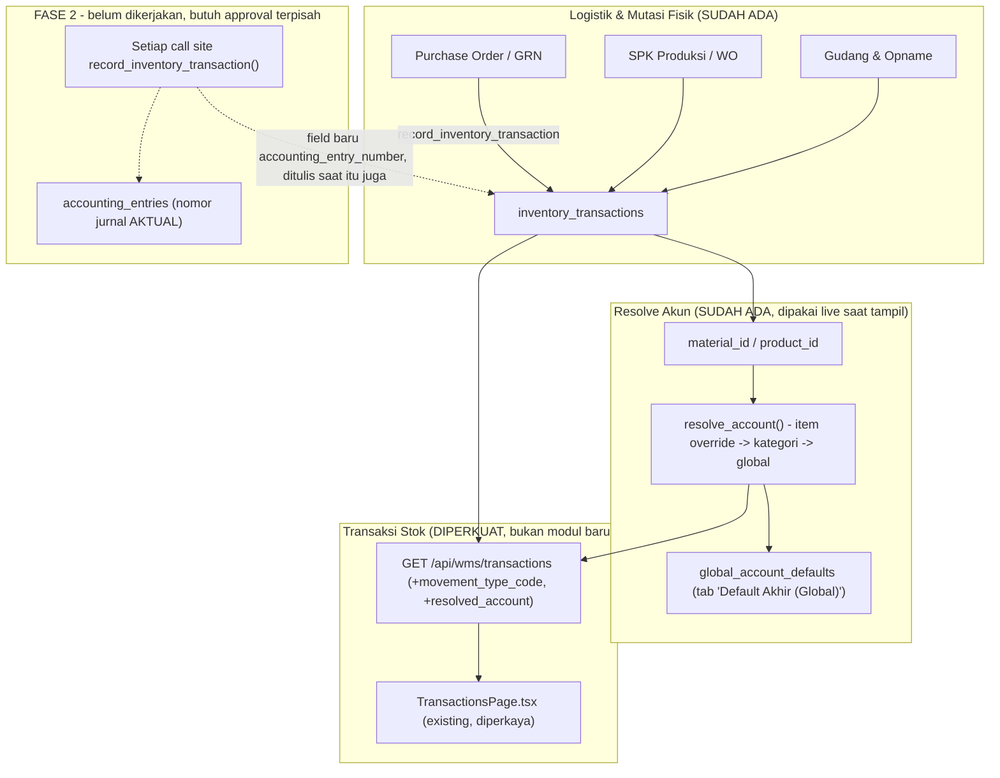

# Rencana Teknis: Mutasi Persediaan & Jurnal (Standar SAP MB51, Terintegrasi COA)

> [!IMPORTANT]
> Revisi 2026-09-21. Rencana asli meminta modul terpisah baru (endpoint `/api/wms/movement-ledger`
> + halaman `InventoryMovementLedger.tsx`). Sejak rencana itu ditulis, ledger stok terpusat
> (`InventoryTransaction`) sudah selesai dimigrasi dari 18 file (commit `ddb6cbc`) dan endpoint/
> halaman **yang sudah ada** (`/api/wms/transactions` + `TransactionsPage.tsx`, menu "Transaksi
> Stok") sudah diperkuat dengan filter lokasi/dokumen-sumber/batch + strip ringkasan. Rencana ini
> direvisi supaya **extend** yang sudah ada, bukan bikin modul kedua yang tumpang tindih.
>
> Verifikasi data riil (2026-09-21) juga mengoreksi satu asumsi rencana asli: kolom
> `accounting_entry_number` per baris mutasi **tidak bisa dihitung dari data yang ada**.
> `InventoryTransaction.reference_number` dan `AccountingEntry.reference_number` memang sama-sama
> ada, tapi dicek langsung ke DB: GRN-202609-00006 cocok 4x di `InventoryTransaction` tapi 0x di
> `AccountingEntry` (GRN sendiri tidak posting jurnal — Purchase Invoice yang posting, terpisah);
> INV-202609-00005 cocok 2x di `AccountingEntry` tapi 0x di `InventoryTransaction` (invoice tidak
> menggerakkan stok — shipping yang menggerakkan, dengan reference_number SO, bukan invoice).
> Tidak ada satu kunci bersama yang menghubungkan baris stok ke baris jurnal untuk event yang sama.
> Link semacam itu hanya bisa akurat kalau ditulis eksplisit saat posting terjadi — lihat Fase 2.

---

## 1. Latar Belakang & Tujuan

1. Setiap mutasi fisik barang perlu nilai moneter (`unit_cost` × `quantity` — sudah ada di
   `InventoryTransaction`).
2. Setiap mutasi barang idealnya terikat ke akun COA. Karena link *aktual* ke jurnal per baris
   belum bisa ditelusuri balik dari data lama (lihat catatan revisi di atas), Fase 1 menampilkan
   akun COA **hasil resolve** (item override → kategori → global, pakai helper
   `resolve_account()`/`resolve_payroll_account()` yang sudah ada, dan tab "Default Akhir (Global)"
   yang baru dibangun) — jelas diberi label "akun (hasil resolve)", bukan diklaim sebagai nomor
   jurnal aktual yang sudah pernah diposting.
3. Movement Type distandarisasi ke kode 3-digit gaya SAP (101/261/311/551/601/701/702 dst) sebagai
   **label tampilan** yang di-derive dari kombinasi `transaction_type` + `reference_type` +
   `direction` yang sudah ada — bukan kolom baru di database, supaya tidak perlu migrasi lagi.
4. Tetap satu halaman ("Transaksi Stok" yang sudah ada), diperkaya, bukan modul terpisah.

---

## 2. Arsitektur Data (Revisi)

### Movement Type Code (label tampilan, di-derive - bukan kolom DB baru)

| Kode | Nama | Arah | Diturunkan dari (transaction_type / reference_type) |
| :---: | :--- | :---: | :--- |
| **101** | Penerimaan Barang dari Vendor | IN | `transaction_type='stock_in'` & `reference_type='purchase_order'` |
| **131** | Penerimaan Barang Jadi Produksi | IN | `reference_type` mengandung `wo_cancellation_reversal`/`batch_confirmation_cancel`/`fg_conversion`, direction=in |
| **261** | Pengeluaran Bahan Baku ke SPK | OUT | `reference_type='material_issue'`, direction=out |
| **311** | Transfer Antar Gudang/Lokasi | IN/OUT | `transaction_type='transfer'` |
| **551** | Barang Rusak / Reject / QC Disposition | OUT | `transaction_type='qc_disposition'`, direction=out |
| **601** | Pengiriman ke Pelanggan | OUT | `reference_type='sales_order'`, direction=out |
| **701/702** | Penyesuaian Opname (lebih/kurang) | IN/OUT | `transaction_type='adjustment'` |
| **999** | Lainnya (fallback) | - | tidak match pola di atas - tetap tampilkan `transaction_type` asli |

---

## 3. Backend (extend `backend/routes/wms_advanced.py`, endpoint yang sudah ada)

Tidak ada endpoint baru. Yang ditambah ke `GET /transactions`, `/transactions/summary`, dan
`/transactions/<id>` yang sudah ada:

1. Field turunan `movement_type_code` + `movement_type_label` per baris (fungsi murni Python,
   mapping tabel di atas — tidak query tambahan).
2. Field turunan `resolved_account` (`{code, name, source}` dengan `source` salah satu dari
   `'item_override' | 'category_default' | 'global_default' | 'unresolved'`) — panggil
   `resolve_account()`/`resolve_payroll_account()` yang sudah ada, bungkus dengan try/except supaya
   baris yang gagal resolve tidak men-500-kan seluruh list (tampilkan `source: 'unresolved'`).
3. Pada `/transactions/<id>` (drilldown detail): tambah blok `document_flow` — ambil dokumen sumber
   asli (pakai `reference_type` + `reference_id` yang sudah akurat, sudah dipakai di seluruh
   migrasi kemarin) dan tampilkan nomor + status singkatnya (PO/SO/WO/dll), TANPA mengklaim ada
   nomor jurnal aktual di baris itu kecuali kebetulan ditemukan lewat `reference_number` match
   (best-effort, ditampilkan dengan disclaimer bila ada).

**Bukti uji**: script verifikasi lewat `app.test_client()` + JWT nyata (bukan raw SQL), menampilkan
output JSON nyata untuk beberapa baris dengan `movement_type_code` dan `resolved_account` terisi.

---

## 4. Frontend (extend `frontend/src/pages/WMS/TransactionsPage.tsx`, sudah ada)

Tidak ada file baru. Ditambah ke halaman yang sudah ada:

1. Kolom "Kode Gerakan" (badge kecil, kode 3-digit + label singkat) di tabel.
2. Kolom "Akun COA (hasil resolve)" menampilkan `resolved_account.code - resolved_account.name`,
   dengan badge kecil menunjukkan sumbernya (Item/Kategori/Global) atau "Belum resolve" (warna
   amber) kalau `source: 'unresolved'` — supaya langsung kelihatan kalau ada gap konfigurasi,
   konsisten dengan tab "Default Akhir (Global)" yang baru dibangun.
3. Klik baris → buka drawer detail (bukan halaman terpisah `TransactionDetail.tsx` yang sudah ada,
   cukup ditingkatkan) menampilkan `document_flow`.
4. Ekspor Excel/CSV dari hasil filter aktif, pakai `frontend/src/utils/exportUtils.ts` yang sudah
   ada di sistem (bukan bikin utility ekspor baru).

---

## 5. Tahapan Eksekusi

### Langkah 1 — Backend: movement_type_code + resolved_account (SEKARANG)
1. Tambah fungsi derive `movement_type_code`/`label` di `wms_advanced.py`.
2. Tambah `resolved_account` ke response `to_dict()`-based serialization (dipanggil di endpoint,
   bukan di model, supaya model tetap murni data).
3. Bukti uji nyata lewat `test_client()`.

### Langkah 2 — Frontend: kolom kode gerakan + akun resolve
1. Tambah 2 kolom ke tabel `TransactionsPage.tsx`.
2. Tambah badge sumber resolusi akun.

### Langkah 3 — Drilldown `document_flow` di `TransactionDetail.tsx` (sudah ada, diperkuat)
1. Tampilkan dokumen sumber asli dari `reference_type`/`reference_id`.

### Langkah 4 — Ekspor Excel/CSV
1. Sambungkan ke `exportUtils.ts` yang sudah ada.

### Fase 2 — SELESAI DIEKSEKUSI 2026-09-21 (cakupan terbatas, disengaja)
Kolom `accounting_entry_number`/`accounting_entry_status` ditambah ke `InventoryTransaction`
(migrasi Alembic `f3e34df7965f`) dan diisi HANYA di titik kode yang sudah diaudit benar-benar
memposting stok + jurnal dalam fungsi yang sama secara sinkron.

**Hasil audit**: dari 18 file yang dimigrasi minggu lalu, **cuma 1 titik** yang memenuhi kriteria —
`routes/purchase_return.py:approve_purchase_return()`. Semua titik lain (GRN, Shipping, Production,
dll) sengaja TIDAK ditautkan karena jurnalnya memang diposting belakangan oleh dokumen terpisah
(Purchase Invoice, Sales Invoice, dll) — bukan bug, itu realitas proses bisnisnya. Menautkan titik
lain butuh mendesain ulang alur (posting jurnal lebih awal, bersamaan dengan pergerakan stok) —
perubahan struktural yang lebih besar, di luar scope pass ini.

Terverifikasi ujung-ke-ujung lewat API nyata: retur pembelian PR260921410328 → approve →
`InventoryTransaction` baris stok dapat `accounting_entry_number='JE-202609-00019'`,
`status='posted'`, dan `JE-202609-00019-01`/`-02` terkonfirmasi ada di `accounting_entries`
sebagai jurnal riil dan seimbang (Dr Hutang Usaha 2.500 / Cr Persediaan Bahan Baku 2.500).

---

## 6. Status Keputusan

1. Nama modul: tetap **"Transaksi Stok"** (bukan modul baru "Mutasi Persediaan & Jurnal") — extend,
   bukan duplikasi.
2. Penempatan: tetap di menu **WMS Advanced** (bukan pindah ke grup Laporan).
3. Status: **Disetujui, dieksekusi 2026-09-21 (Fase 1 & Fase 2).**
4. Fase 2 (link jurnal aktual per baris): **selesai untuk 1 titik yang valid** (Retur Pembelian).
   Memperluas ke titik lain butuh keputusan desain baru (kapan jurnal diposting) — rencana lanjutan
   terpisah, belum disetujui.

---

## 7. Fase 3 — GR/IR Clearing (GRN & Shipping posting jurnal), disetujui 2026-09-21

**Audit pra-desain** (lihat riwayat kerja) menemukan:
- Purchase Invoice SEKARANG posting Dr Persediaan/Beban → Cr Hutang Usaha, nilai dari input manual
  saat invoice dibuat (bukan qty GRN). GRN tidak posting jurnal apa pun saat ini.
- Sales Invoice SEKARANG posting Dr Piutang → Cr Penjualan saja. **HPP/COGS tidak diposting di mana
  pun** di seluruh sistem — celah nyata, bukan cuma "belum ada di Shipping".

**Desain:**
- **GRN**: posting Dr Persediaan / Cr akun baru "GR/IR Clearing" (kewajiban sementara, transaction_key
  baru di `GlobalAccountDefault`) saat barang diterima — nilai dari harga PO.
- **Purchase Invoice**: baris debit yang SEKARANG menyasar Persediaan/Beban diubah menyasar GR/IR
  Clearing (membalik kewajiban sementara), Cr Hutang Usaha tetap seperti sekarang. Ini SATU-SATUNYA
  modifikasi ke kode Invoice yang sudah live — wajib diverifikasi tidak dobel-hitung.
- **Shipping**: posting Dr HPP (COGS) / Cr Persediaan Barang Jadi saat barang dikirim — PENAMBAHAN
  murni (mengisi celah yang memang kosong), cost basis = FIFO `unit_cost` riil dari batch yang
  dipakai `fifo_deduct_stock()`, bukan standard cost.
- Sales Invoice TIDAK diubah (tidak pernah posting COGS, jadi tidak ada risiko dobel-hitung di sana).

**Status: SELESAI DIEKSEKUSI & terverifikasi ujung-ke-ujung lewat API nyata 2026-09-21:**
- Akun baru "2-1050 GR/IR Clearing - Barang Diterima Belum Ditagih" dibuat, didaftarkan sebagai
  `gr_ir_clearing` di Default Akhir (Global).
- Akun "5-1000 Harga Pokok Penjualan" (sudah ada, ternyata sudah jadi akun HPP gabungan yang tepat)
  didaftarkan sebagai `akun_hpp_id`.
- Bug tambahan ditemukan+diperbaiki sekalian: `fifo_helper.py:_get_inventory_unit_cost()` masih
  query tabel `InventoryMovement` yang sudah berhenti menerima data sejak migrasi ledger minggu lalu
  — jadi biaya asal (unit_cost) barang yang diterima setelah migrasi selalu jatuh ke fallback
  material/product cost, bukan biaya penerimaan riil. Diperbaiki untuk query `InventoryTransaction`.
  GRN & Shipping juga diperbaiki supaya keduanya benar-benar mengisi `unit_cost` saat mencatat
  pergerakan stok (sebelumnya tidak pernah diisi).
- Verifikasi GRN→GR/IR: GRN-202609-00010 (PO-202609-00007) → JE-202609-00020 Dr Persediaan Bahan
  Baku 4.000.000 / Cr GR/IR Clearing 4.000.000.
- Verifikasi Invoice→reversal: PI-202609-00003 (PO sama) → JE-202609-00021 Dr GR/IR Clearing
  4.000.000 / Cr Hutang Usaha 4.000.000. Saldo GR/IR Clearing bersih = 0 (terbukti tidak dobel-hitung
  Persediaan).
- Verifikasi Shipping→COGS: SHP-202609-00016 (20 pcs @ Rp15.000) → JE-202609-00022 Dr HPP 300.000 /
  Cr Persediaan 300.000.
- **Temuan finansial nyata (belum diperbaiki, bukan keputusan sepihak saya)**: default global
  `akun_persediaan_id` sekarang menyasar akun "1-1200 Persediaan Bahan Baku" untuk SEMUA item
  (termasuk produk barang jadi tanpa override kategori/item sendiri) — jadi COGS shipment produk
  jadi sekarang meng-kredit akun Persediaan Bahan Baku, bukan akun Persediaan Barang Jadi terpisah.
  Ini konfigurasi yang sudah ada sebelumnya (bukan diperkenalkan Fase 3), tapi baru terlihat jelas
  dampaknya sekarang karena Shipping mulai memposting jurnal. Solusinya: set `akun_persediaan_id` di
  level Kategori untuk kategori Barang Jadi (lewat tab "Barang & Jasa"), atau buat akun Persediaan
  Barang Jadi terpisah - keputusan ini diserahkan ke user/finance, bukan diputuskan sepihak di sini.

---

## 9. Penutup Fase 2 — Stok Opname posting jurnal, disetujui & selesai 2026-09-21

Titik kecil terakhir yang tersisa dari cakupan Fase 2 (setelah Fase 3 menutup 2 gap terbesar, GRN &
Shipping): `apply_stock_opname_adjustments()` di `routes/stock_opname.py`, dipakai baik oleh endpoint
approve langsung maupun alur ApprovalWorkflow generik.

**Desain**: akun "6-7000 Selisih Persediaan" (sudah ada & sudah dikonfigurasi sebelumnya di
`InventoryAccountSettings.akun_penyesuaian_id` — tidak perlu bikin akun baru) dipakai dua arah:
varian lebih (ditemukan lebih banyak dari catatan) → Dr Persediaan / Cr Selisih Persediaan; varian
kurang (ditemukan lebih sedikit, kerugian) → Dr Selisih Persediaan / Cr Persediaan. Nilai dari FIFO
`unit_cost` riil batch yang disesuaikan.

**Verifikasi ujung-ke-ujung lewat API nyata**: SO-202609-00002 (varian -5 pcs @ Rp15.000) →
JE-202609-00023 Dr Selisih Persediaan 75.000 / Cr Persediaan Bahan Baku 75.000.

**Bug tambahan ditemukan+diperbaiki (tak terkait, blocking saat verifikasi)**:
`generate_opname_items()` di file yang sama memakai `product.uom`/`material.uom` — field yang tidak
ada di kedua model (nama field asli `primary_uom`), jadi endpoint create-order selalu crash 500 untuk
lokasi mana pun yang isinya campuran produk+material. Diperbaiki.

**Fase 2 dinyatakan selesai** untuk cakupan yang realistis (Retur Pembelian, GRN, Shipping, Stok
Opname) — titik-titik lain yang masih tanpa posting jurnal (Payroll sudah ada dari sebelumnya;
Production/WIP costing) butuh keputusan desain terpisah, belum dikerjakan.

---

## 10. Catatan: Rencana Terpisah dari QA (belum dikerjakan, hanya dicatat 2026-09-21)

QA meminta fitur **master data efektif-bertanggal + change number**, cakupan: SEMUA field master
data Product & Material (termasuk Harga & Biaya, dan BOM/Formula Produksi) — bukan cuma yang
dipakai Fase 3. Konsepnya: perubahan master data dibuat dengan tanggal berlaku di masa depan (mis.
diubah hari Selasa untuk berlaku hari Jumat — data lama tetap berlaku Rabu-Kamis), dan **setiap**
perubahan tercatat dengan nomor perubahan (change number) beserta detailnya. Ini fitur terpisah dan
cukup besar (mirip Engineering Change Management/ECM di SAP) — belum disetujui untuk dieksekusi,
perlu rencana tersendiri setelah Fase 3 selesai.
